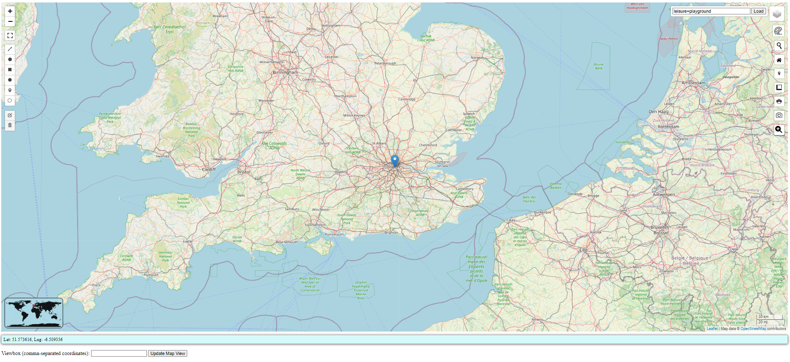

# Interactive Web mapping using leaflet.js and its plugins

## Go to [Web App](https://shiwakotisurendra.github.io/leaflet-geosuren/)

### Leaflet web-map application..
* with multiple base maps(osm,osmTOPO,openseamap,ESRIWorldImagery)
* draggable GeoJSON support (tooltip and popup)
* mouseover latlon feature
* mouseclick latlon popup feature
* draw different shapes on the map and export to geojson
* get bounding box from specific shape (rectangle and polygon)
* angle/bearing measurements between two points with measure
* mini-map plugin 

#### Interactive Web Map Layout 

